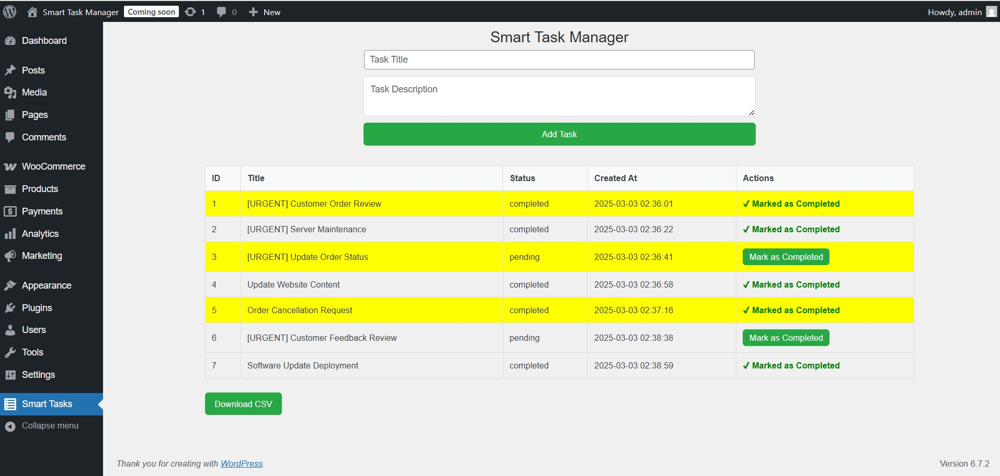
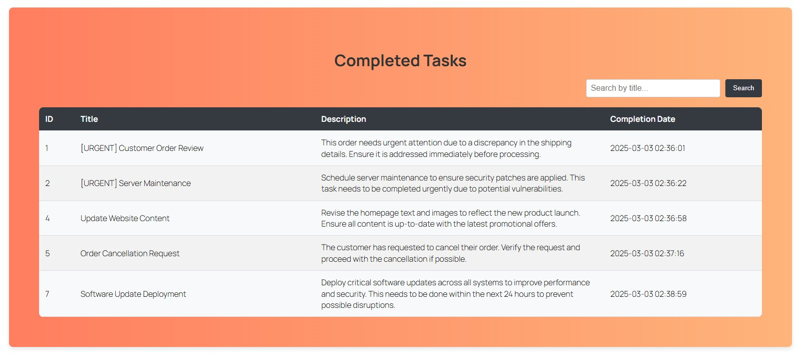
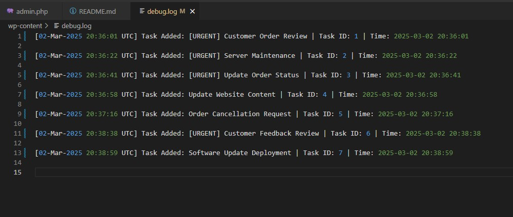

# Smart Task Manager - WordPress Plugin

## Overview

Smart Task Manager is a WordPress plugin that allows users to manage tasks within the WordPress admin dashboard. It provides task creation, status updates, AJAX functionality, and a front-end display. The plugin also integrates with WooCommerce and includes an export feature for CSV downloads.

## Installation Instructions

1.  Download the plugin ZIP file.
2.  Go to your WordPress admin dashboard.
3.  Navigate to **Plugins > Add New**.
4.  Click **Upload Plugin**, select the ZIP file, and click **Install Now**.
5.  Activate the plugin from the Plugins menu.

## Setup

1.  **Enable debug.log for Logging:**
    * Open your `wp-config.php` file.
    * Add the following lines of code above the line that says "That's all, stop editing! Happy blogging.":
        ```php
        define('WP_DEBUG', true);
        define('WP_DEBUG_LOG', true);
        define('WP_DEBUG_DISPLAY', false);
        ```
    * This will enable the logging of tasks to the `debug.log` file located in the `wp-content` directory.
2.  **Shortcode Usage:**
    * Use the `[smart_tasks]` shortcode to display completed tasks on the frontend.
    * You can add this shortcode in any post, page, or content area.
        * `[smart_tasks]`

## Features and Implementation Details

1.  **Custom Admin Page**
    * Created a menu item "Smart Tasks" in the WordPress admin sidebar.
    * Developed a custom admin page that displays a table of tasks with columns: Task ID, Title, Status (Pending/Completed), and Date Created.
    * Added a form above the table to add new tasks, allowing users to enter Title and Description.
    * Used WordPress’s built-in functions to enqueue styles and scripts for the admin panel.
2.  **Database Integration**
    * Created a custom database table `wp_smart_tasks` using `$wpdb` on plugin activation.
    * Stored tasks with columns: `id`, `title`, `description`, `status` (default: "pending"), and `created_at`.
    * Ensured the table is removed on plugin deactivation to maintain cleanliness.
3.  **Actions and Filters**
    * Implemented an action hook to log task creation details (task title and timestamp) into the `debug.log` file.
    * Created a filter hook to modify the task title before saving. If the description contains the word "urgent", the title is prepended with `[URGENT]`.
4.  **Front-End Display**
    * Implemented the `[smart_tasks]` shortcode to display completed tasks on the front-end.
    * Used HTML, CSS, Bootstrap, and PHP for rendering tasks instead of React.
    * Styled the output for a clean and user-friendly display.
5.  **AJAX Functionality**
    * Added a "Mark as Completed" button next to each task in the admin table.
    * Used AJAX to update the task status in the database without a page reload.
    * Implemented WordPress nonces for security.
    * Displayed an error message if the AJAX request fails.
6.  **WooCommerce Integration**
    * Checked if WooCommerce is active.
    * If a task title contains "order", highlighted the row in yellow in the admin task table.
    * Used a WooCommerce hook to apply this feature.
7.  **Debugging Challenge**
    * **Introduced Bug:** When a task is marked as completed, the status is updated in the database, but it does not reflect immediately in the admin table until the page is refreshed.
    * **Solution:** The issue arises because the AJAX handler updates the task status in the database but does not send the updated task status to the front-end. To fix this, the AJAX handler is modified to return the updated task data, including the task ID and status. On the front-end, the JavaScript uses this returned data to dynamically update the task row in the admin table without requiring a page refresh.

## Bonus Features

1.  **Export Tasks as CSV**
    * Implemented a button in the admin panel to export tasks as a CSV file.
    * Limited access to users with the `manage_options` capability for security.
2.  **Performance Optimization**
    * Implemented caching using WordPress transients to store task data and reduce database queries.
    * Tasks are refreshed when changes are made to maintain accuracy while improving performance.

## AI Assistance

ChatGPT was used in the following areas:

* **Debugging:** Implemented logging functionality using `debug.log` to track when tasks are added.
* **Shortcode Implementation:** Helped create the `[smart_tasks]` shortcode for displaying completed tasks on the frontend.
* **AJAX Implementation:** Assisted with the AJAX functionality to mark tasks as completed without reloading the page.
* **CSV Export:** Provided guidance on exporting tasks to a CSV file.

## Assumptions and Creative Decisions

* Implemented a search bar on the front-end, allowing users to easily filter and find specific tasks from the task list.
* Replaced React with PHP and Bootstrap for front-end task display.
* Improved UI/UX with a simple and clean design.

## Version Control

* Used GitHub for version control.
* Followed WordPress coding standards and best practices for maintainability.

## Conclusion

This plugin successfully implements task management inside the WordPress admin dashboard, with AJAX-based updates, WooCommerce integration, and an export feature. The debugging challenge was addressed, and best security and performance practices were followed throughout development.

## Screenshots

1.  **Smart Tasks page from Admin dashboard:**

    

2.  **Completed tasks display in frontend:**

    

2.  **Showing Debug.log after adding tasks:**

    